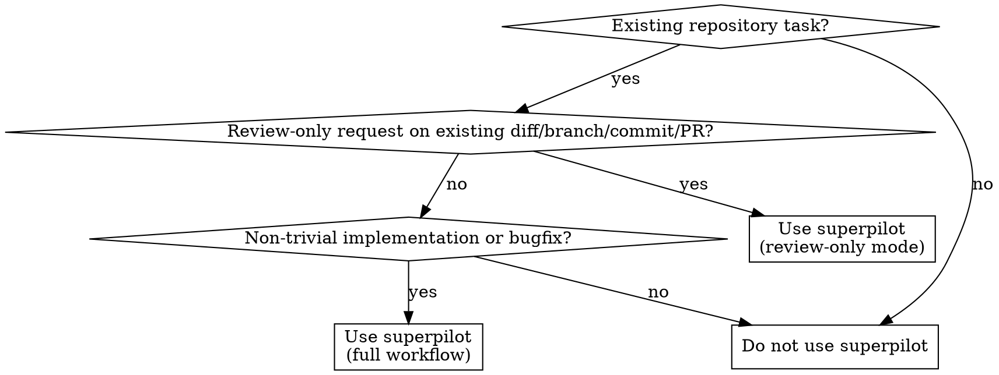

# Superpilot

## Mission

Use this skill for non-trivial work in an existing repository when the job should move from collaborative design into autonomous implementation without depending on any external workflow skill pack.

This skill is self-contained:

- do not rely on external workflow skills to define the core process
- do not scan for other workflow skills before each stage
- use runtime tools, shell commands, git, and subagents directly when needed
- do not commit, push, or open PRs unless the user explicitly asks

The default objective is zero-intervention completion:

- drive the task from first read to verified handoff without waiting for routine approvals
- research before guessing when external facts, library behavior, or domain rules affect the solution
- preserve the full requested scope from user request -> spec -> plan -> implementation -> review -> verification
- choose the execution topology yourself: in-place, isolated branch/worktree, direct execution, or bounded fresh subagents
- prove real readiness with the strongest relevant checks, including user-flow, DX, migration, and security checks when applicable

## When to Use

Use `superpilot` when working in an existing repository and the task needs disciplined execution, such as:

- bug fixes
- feature work
- refactoring tied to a real request
- config, CI, or workflow changes
- test additions or test repair
- review-only audits of an existing diff, branch, commit, or pull request



## When Not to Use

Do not use `superpilot` for:

- greenfield project creation
- simple factual questions or code explanation with no change requested
- release or deployment orchestration by default
- commit or PR workflow by default

## Workflow

For non-trivial work, follow this path:

1. Explore repository context, local guardrails, current baseline, and whether isolated execution is needed
2. Research external facts, library behavior, domain constraints, and prior art when uncertainty or risk is real
3. Clarify only what is materially ambiguous
4. Collaborate with the user on the design and pressure-test framing, scope, UX, DX, and risk
5. Write a spec — load [references/spec.md](references/spec.md) first
6. Write a plan — load [references/plan.md](references/plan.md) first
7. Investigate root cause first when debugging is needed — load [references/debugging.md](references/debugging.md) first
8. Load [references/implementation.md](references/implementation.md), then execute autonomously following its TDD, isolation, and execution rules
9. **Mandatory transition**: when implementation reaches GREEN, stop and load [references/review.md](references/review.md) before any other action. GREEN tests do not authorize completion — only a zero-findings review loop does. **This transition is never exempt — not by trivial status, not by mechanical simplicity, not by test confidence.**
10. Run harsh review-and-patch loops on the diff following the loaded review procedure, including requirement-preservation and drift checks
11. Verify with fresh evidence — load [references/verification.md](references/verification.md) first
12. Deliver a completion summary and capture reusable learnings when they materially reduce future rework

Each stage must Read the linked reference file before starting work. Skipping a reference load is not allowed — the reference defines how to execute the stage, not just what the stage is about.

### Stage transition markers

Each stage ends with a completion marker that confirms the stage was properly completed before moving on. These markers serve as handoff contracts between stages.

| Stage | Exit marker | Meaning |
|-------|-----------|---------|
| Spec | `## SPEC COMPLETE` | Spec written, self-reviewed, path provided |
| Plan | `## PLAN COMPLETE` | Plan written, self-reviewed, execution mode chosen |
| Debugging | `## ROOT CAUSE CONFIRMED` | Root cause proven by evidence, captured in plan |
| Implementation | `## IMPLEMENTATION GREEN` | All slices green, ready for review |
| Review | `## REVIEW COMPLETE — 0 FINDINGS` | Zero findings on fresh final pass |
| Verification | `## VERIFICATION PASSED` | Fresh evidence supports all claims |

When transitioning between stages, confirm the previous stage's exit marker condition is met. Do not advance if the exit condition is not satisfied.

For agent recovery interruptions, the current stage's marker remains unsatisfied. After recovery, resume from the incomplete stage, not the next one.

Once the request is clear enough to produce a correct spec, treat the original user request as authorization to continue through planning and implementation. Do not introduce approval gates unless a safety gate triggers.

If the user explicitly asks for review-only output on an existing diff, branch, commit, or pull request, switch to review-only mode:

- skip spec, plan, and implementation
- inspect the diff and return findings only
- do not patch unless the user explicitly asks for fixes
- still apply the same review standard, but treat findings as report output rather than internal patch work

## Hard Rules

- Treat repository-local agent instruction files such as `AGENTS.md` and `CLAUDE.md` as strong local rule sets.
- Optimize for zero-intervention completion. Ask the user only when proceeding would materially risk building the wrong thing or doing something unsafe.
- For non-trivial work, always produce both a spec and a plan.
- Review-only requests are an explicit exception to the spec-and-plan rule.
- Research before deciding when external APIs, third-party libraries, current product facts, or domain rules could change the correct implementation.
- Maintain a requirement ledger from the original request through final verification. Do not silently reduce scope, drop requested outcomes, or “simplify” by omission.
- When the task involves a bug, test failure, build failure, or unexpected behavior, investigate root cause before proposing fixes.
- Use TDD for feature work, bug fixes, refactoring, and behavior changes when there is a real executable test surface.
- Choose the execution strategy yourself. Do not ask the user to choose direct execution vs subagent execution.
- Prefer isolated execution (clean branch or worktree) when the tree is dirty, parallel work is active, or the task is risky enough that comparison/rollback clarity matters.
- Use subagents only when task independence is clear and write scopes do not overlap.
- Use fresh subagent context per independent task unless there is a strong reason to reuse prior context.
- Final integration, final review, and final verification always belong to the main agent.
- Review the diff, not the untouched codebase, and keep looping until actionable findings reach zero.
- Every review pass must run mandatory trace activities, walk through every checklist item, and answer every adversarial question against the diff. A review pass that skips any of these is not a valid pass and does not count toward the zero-findings exit condition.
- Mandatory trace activities require tracing actual code paths (failure paths, state consistency, access control, input boundaries), not checking boxes. If the diff has an external API call, trace what happens when it fails. If the diff has a new endpoint, compare its access control to existing endpoints. If the diff updates state in two places, trace what happens when one update fails.
- For request-entry, redirect, auth, middleware, canonicalization, token, cookie, query-param, or session changes, treat execution order and preservation of global invariants as first-class review concerns, not implicit assumptions.
- For schema, contract, codegen, fixture, or documentation-coupled changes, treat missing paired updates as in-scope defects, not optional cleanup.
- For user-facing, onboarding, or developer-workflow changes, code inspection alone is not enough — verify the real flow with the strongest available walkthrough, browser, or smoke path.
- For security-sensitive work, make the threat model explicit in review and verification instead of assuming normal tests cover it.
- Treat review findings as internal work items unless the user explicitly asks for a review-only report.
- For implementation tasks, do not call the work complete until the internal review loop has already absorbed and patched all in-scope actionable findings.
- Do not call the task complete until a fresh final review pass after the last patch also returns zero actionable findings.
- If a subsequent "code review" request on the same finished diff would find real in-scope issues, the original review loop failed. The review must be thorough enough that a second independent review should not uncover anything new.
- Do not treat passing tests, a green build, or a reproduced fix as a substitute for the final review loop. Verification does not replace review.
- If you cannot point to fresh final review evidence for the current diff, the task is not complete yet.
- Never claim completion without fresh verification evidence.
- Do not do speculative refactoring or unrelated cleanup.
- Do not commit, push, or publish unless the user explicitly asks.

## Trivial Exception

Only truly trivial work may skip the spec and plan. A task is trivial only when **all four** of these are true:

- single-line or few-character change
- zero ambiguity about what to change
- zero side-effect risk
- no design decision involved

### Quantitative guard

If **any** of these is true, the task is **not trivial** regardless of how mechanically simple each individual change looks:

- 2+ files changed
- 3+ change sites (hunks)
- an existing test would break from the change

### Anti-rationalization patterns

These are **not** valid arguments for trivial classification:

- "same pattern repeated across files → effectively single-line" — the rule measures **change scope** (file count, site count), not pattern complexity
- "mechanical / search-and-replace change → trivial" — mechanical changes across multiple files have higher miss risk, not lower
- "display-only / formatting change → zero side-effect" — if a test asserts the old format, side-effect risk is nonzero
- "simple change, so process cost exceeds risk" — simple changes are cheap to review; skipping is where the real cost hides

### What trivial skips and what it does not

Trivial work may skip the **spec and plan** only. It must still respect:

- TDD — if a test surface exists (including existing tests that would break), TDD applies
- review loop — the mandatory transition from GREEN to review is **never** skipped by trivial status
- local guardrails (AGENTS.md, CLAUDE.md)
- verification
- scope discipline

**The trivial exception is narrow by design.** When in doubt, classify as non-trivial. The cost of running an unnecessary review loop is minutes; the cost of shipping an unreviewed multi-file change is a bug.

## Storage

Write specs and plans under:

```text
~/.superpilot/docs/<repo-name>/
├── specs/
└── plans/
```

Use the git root basename as `<repo-name>`. Name files as:

```text
YYYY-MM-DD-<short-slug>.md
```

Use short slugs that describe the task itself, not the branch name.

## References

Load the relevant reference file for the current stage:

- [references/spec.md](references/spec.md): collaborative design, spec writing, execution transition
- [references/plan.md](references/plan.md): implementation planning and subagent split rules
- [references/debugging.md](references/debugging.md): root-cause investigation before fixes
- [references/implementation.md](references/implementation.md): TDD, execution discipline, blocker handling
- [references/review.md](references/review.md): harsh diff review procedure and checklist
- [references/verification.md](references/verification.md): evidence-based verification and completion rules
- [references/agent-recovery.md](references/agent-recovery.md): agent loop, drift, and degradation detection and recovery

The main file defines the contract. The reference files define how to execute each stage.

## Context Management

### Context budget tiers

Be aware of how much context has been consumed during the session. Adjust behavior as context fills:

| Tier | Utilization | Behavior |
|------|------------|----------|
| PEAK | 0–30% | Full exploration, detailed traces, read broadly |
| GOOD | 30–50% | Normal execution, read what is needed |
| DEGRADING | 50–70% | Prefer targeted reads over broad exploration, keep review traces focused on changed code, avoid re-reading unchanged files |
| POOR | 70%+ | Finish current task minimally, suggest compaction before starting new work, do not start new exploration |

### Degradation warning signs

Watch for these signals that context quality is dropping:

- review traces becoming shallow or generic
- skipping checklist items or adversarial questions
- making claims without running verification
- losing track of prior findings or plan progress
- responses becoming vague where they were previously specific

If 2+ of these appear, enter agent recovery — load [references/agent-recovery.md](references/agent-recovery.md).

### Context-rot countermeasures

When work is large or long-running:

- prefer bounded fresh subagents over carrying every detail in the main context
- summarize decisions at stage boundaries so the session can recover after compaction
- keep external research notes short and decision-oriented instead of pasting long references into the main thread
- re-open source material when needed rather than trusting degraded memory

### Strategic compaction

Do not wait for automatic compaction to disrupt the workflow. Suggest manual compaction at natural stage boundaries:

**Good compaction points:**

- after spec is written, before planning starts
- after plan is written, before implementation starts
- after implementation reaches GREEN, before review starts
- after review loop completes, before verification starts

**Bad compaction points:**

- mid-implementation between TDD cycles
- mid-review between finding and patching
- while waiting for a subagent to return

When suggesting compaction, include a brief state summary so context can be recovered:

```
현재 상태: [stage] 단계, [task X/N] 진행 중
완료: [what is done]
남은 작업: [what remains]
현재 블로커: [if any]
```

## User Signal Detection

When the user expresses frustration or redirects the approach, treat it as an immediate process reset signal. Do not continue the current path.

**Reset signals** — any of these means "stop and re-investigate from scratch":

- "Stop guessing" / "추측 그만"
- "That's not it" / "그게 아니라"
- "You're going in circles" / "계속 반복하고 있잖아"
- "Think harder" / "더 생각해봐"
- "Read it again" / "다시 읽어봐"
- Repeating the same instruction a second time
- Rejecting two consecutive proposed approaches

**On reset signal:**

1. stop the current action immediately
2. re-read the original error, spec, or user request from source — do not rely on your summary of it
3. re-enter the appropriate stage from the beginning (debugging → step 1, implementation → re-read plan, review → re-capture diff)
4. if the same approach was already tried, form a materially different hypothesis before proceeding

Do not apologize and retry the same thing. The signal means the current approach is wrong, not that it needs one more attempt.

## Safety Gates

Stop and ask the user only when:

- an action is destructive or irreversible
- credentials, secrets, or access are missing
- requirements are contradictory or newly unsafe

Do not stop for routine execution choices, planning choices, or implementation sequencing.

## Non-Goals

This skill is not for:

- greenfield project creation
- release or deployment orchestration by default
- commit and PR workflows by default
- replacing repository-specific rules in `AGENTS.md`
